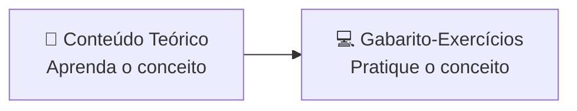
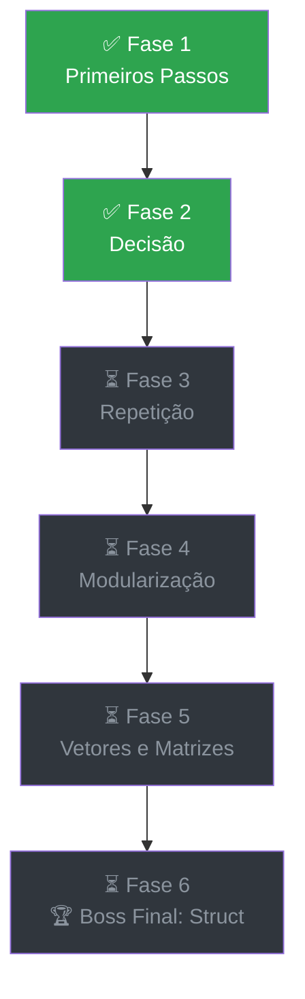

# 📖 Conteúdo Teórico

### A base de cada fase, explicada antes da prática

*Toda boa jornada de programação começa com uma boa história.*

 

---

## 🧭 Sobre esta pasta

Aqui ficam as **apostilas teóricas** que sustentam cada fase da trilha de Fundamentos da Programação em C. Antes de qualquer exercício, é aqui que o conceito é apresentado: com linguagem acessível, analogias lúdicas e exemplos comentados, pensados para quem está tendo o primeiro contato com lógica de programação.

Os exercícios que colocam essa teoria em prática vivem em [`Gabarito-Exercícios`](../Gabarito-Exercícios) — pense nesta pasta como o **"antes"** e naquela como o **"depois"**.

---

## 🗂️ Apostilas disponíveis

<table>
<tr>
<td width="70" align="center">🧩</td>
<td>

**Fase 1 — Primeiros Passos em C**
Constantes, variáveis, expressões, comandos de entrada e saída, e os primeiros laços de repetição.

📄 [`Fase 1 - Primeiros Passos em C.pdf`](<./Fase 1 - Primeiros Passos em C.pdf>)

</td>
</tr>
<tr>
<td align="center">🔀</td>
<td>

**Fase 2 — O Programa Aprende a Decidir**
Estruturas de decisão `if/else` e `switch`: ensinando o código a escolher caminhos.

📄 [`Fase 2 - O Programa Aprende a Decidir.pdf`](<./Fase 2 - O Programa Aprende a Decidir.pdf>)

</td>
</tr>
</table>

> 🚧 **Em construção:** as apostilas das Fases 3 a 6 (Laços de Repetição, Modularização, Vetores e Matrizes, Struct) serão publicadas aqui conforme forem concluídas.

---

## 🗺️ A trilha completa

---

## 📌 Como usar

1. **Leia antes de praticar** — cada apostila é o ponto de partida da fase correspondente.
2. **Siga a ordem** — os conceitos são cumulativos; pular uma fase pode deixar lacunas.
3. **Complemente com o gabarito** — os exemplos comentados em C reforçam o que foi lido aqui.

---

⬅️ [Voltar ao README principal](../README.md)

