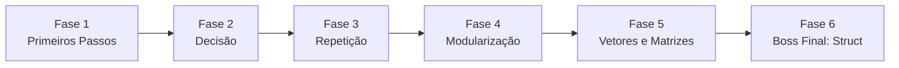

<div align="center">

# 🧩 Try, Catch & Learn

### Recursos Educacionais Abertos para Fundamentos da Programação em C

*Programar é tentar, tratar o erro e aprender com ele.*

<br>


<br>

**Universidade Tecnológica Federal do Paraná — Campus Cornélio Procópio**
Disciplina: **Certificadora de Competência Comum**
Supervisão: **Prof. Dr. André Luís dos Santos Domingues**

</div>

---

## 📑 Sumário

1. [Sobre o projeto](#-sobre-o-projeto)
2. [Objetivo geral](#-objetivo-geral)
3. [Objetivos específicos: a jornada em seis fases](#-objetivos-específicos-a-jornada-em-seis-fases)
4. [Tópicos abordados](#-tópicos-abordados)
5. [Público-alvo e abordagem didática](#-público-alvo-e-abordagem-didática)
6. [Estrutura do repositório](#-estrutura-do-repositório)
7. [Como utilizar os materiais](#-como-utilizar-os-materiais)
8. [Equipe](#-equipe)
9. [Licença e reuso](#-licença-e-reuso)
10. [Como citar](#-como-citar)

---

## 📖 Sobre o projeto

Este repositório reúne os **Recursos Educacionais Abertos (REA)** desenvolvidos pelo grupo **Try, Catch & Learn** no âmbito da disciplina **Certificadora de Competência Comum**, da Universidade Tecnológica Federal do Paraná (UTFPR), Campus Cornélio Procópio.

A proposta parte de uma constatação simples: o primeiro contato com programação costuma ser o maior filtro de acesso à área de tecnologia. Ao transformar conceitos fundamentais em materiais **abertos, lúdicos e didaticamente estruturados**, buscamos reduzir essa barreira de entrada e devolver à comunidade externa o conhecimento produzido na universidade, em consonância com o princípio da extensão universitária.

O nome do grupo faz referência ao bloco `try`/`catch` de tratamento de exceções presente em diversas linguagens: errar faz parte do processo, e o que importa é o que se aprende ao capturar o erro.

---

## 🎯 Objetivo geral

Desenvolver **Recursos Educacionais Abertos (REA)** voltados à disciplina de **Fundamentos da Programação**, com o objetivo de democratizar o acesso ao conhecimento inicial em programação por meio de materiais acessíveis, lúdicos e didaticamente estruturados, facilitando a compreensão de conceitos fundamentais por estudantes iniciantes e/ou público externo.

---

## 🗺️ Objetivos específicos: a jornada em seis fases

O conteúdo foi organizado como uma trilha progressiva, em que cada fase constrói sobre a anterior e culmina em um desafio final.

| Fase | Título | Descrição |
|:----:|--------|-----------|
| **1** | **Primeiros Passos em C** | As primeiras peças do quebra-cabeça: constantes, variáveis, expressões e comandos de entrada e saída, além dos laços de repetição que dão vida à lógica. |
| **2** | **O Programa Aprende a Decidir** | Ensinando o código a "pensar" e escolher caminhos com `if/else` e `switch`. |
| **3** | **Repita Comigo: Laços de Repetição** | Automatizando tarefas repetitivas com laços controlados por contador e por condição, sem perder o controle do fluxo. |
| **4** | **Dividir para Programar: Modularização** | Organizando o código em blocos reutilizáveis com procedimentos e funções, como peças de Lego que se encaixam. |
| **5** | **Muitos Dados, Uma Só Caixa: Vetores e Matrizes** | Lidando com múltiplos dados de um só tipo, de forma organizada e eficiente. |
| **6** | **🏆 Boss Final: A Ficha Completa (Struct)** | Combinando diferentes tipos de dados em uma única estrutura, como uma "ficha" que guarda tudo o que importa sobre um registro. |



---

## 📚 Tópicos abordados

- **Fundamentos de Algoritmos em C**: constantes, variáveis, expressões e comandos de entrada e saída, além dos laços de repetição que dão vida à lógica.
- **Estruturas de Decisão**: ensinando o programa a "pensar" e escolher caminhos com `if/else` e `switch`.
- **Estruturas de Repetição**: automatização de tarefas repetitivas com laços controlados por contador e por condição.
- **Técnicas de Modularização**: organização do código em blocos reutilizáveis com procedimentos e funções.
- **Variáveis Compostas Homogêneas**: vetores e matrizes para tratar múltiplos dados de um mesmo tipo de forma organizada e eficiente.
- **Variáveis Compostas Heterogêneas (`struct`)**: combinação de tipos distintos em uma única estrutura, semelhante a uma ficha de registro.

---

## 👥 Público-alvo e abordagem didática

Os materiais são pensados para **estudantes iniciantes e público externo à universidade**, com atenção especial a jovens e adolescentes em contato com programação pela primeira vez.

Princípios que orientam a produção:

- **Acessibilidade:** linguagem clara, sem pressupor conhecimento prévio.
- **Ludicidade:** enunciados contextualizados e desafios que estimulam a curiosidade.
- **Progressão:** cada fase introduz poucos conceitos novos e retoma os anteriores.
- **Prática guiada:** teoria objetiva acompanhada de exercícios diretos e desafios de maior complexidade.
- **Abertura:** conteúdo livre para uso, adaptação e redistribuição.

---

## 🗂️ Estrutura do repositório

```text
.
├── README.md
├── Gabarito-Exercícios/     # Resoluções em C dos exercícios propostos
└── ...                      # Materiais teóricos e listas de exercícios por fase
```

> 💡 Ajuste a árvore acima conforme a organização final do repositório.

---

## 🚀 Como utilizar os materiais

Os exemplos e gabaritos são escritos em **C padrão** e podem ser compilados com qualquer compilador compatível, como o GCC:

```bash
# Clonar o repositório
git clone https://github.com/RenanCaceres/Certificadora-Comum.git
cd Certificadora-Comum

# Compilar e executar um exercício
gcc -Wall -Wextra -o exercicio arquivo.c
./exercicio
```

---

## 🤝 Equipe

**Grupo Try, Catch & Learn**

| Integrante |
|------------|
| Lauren Marçulo |
| Lorena Eduarda Barros Martinelli |
| Manuella Vieira Reginato |
| Renan Cáceres Anselmo |

**Supervisão:** Prof. Dr. André Luís dos Santos Domingues
**Instituição:** Universidade Tecnológica Federal do Paraná (UTFPR), Campus Cornélio Procópio

---

## 📜 Licença e reuso

Por se tratar de **Recursos Educacionais Abertos**, todo o conteúdo deste repositório (materiais didáticos, listas de exercícios e gabaritos em C) é distribuído sob a licença [**MIT**](LICENSE). Você pode usar, copiar, modificar e redistribuir o material, inclusive para fins comerciais, desde que mantenha o aviso de copyright e o texto da licença em todas as cópias ou partes substanciais.

---

## 🔖 Como citar

```text
TRY, CATCH & LEARN. Recursos Educacionais Abertos para Fundamentos da Programação em C.
Cornélio Procópio: Universidade Tecnológica Federal do Paraná, 2026.
Disciplina: Certificadora de Competência Comum. Supervisão: Prof. Dr. André Luís dos Santos Domingues.
```

---

<div align="center">

**UTFPR — Campus Cornélio Procópio** · Certificadora de Competência Comum · 2026

*Feito com 💛 e muitos `printf("Olá, mundo!");`*

</div>
